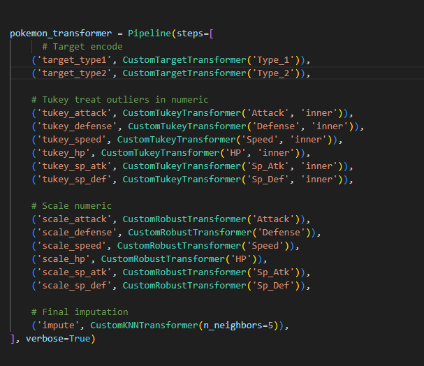

## Pipeline Description

The pipeline is called `pokemon_transformer`. It performs a series of transformations to prepare the Pokémon dataset for modeling. These steps include mapping, target encoding, outlier handling, scaling, and imputation.

### Pipeline Steps

### Feature Columns Used

- `Total`, `Type_1`, `Type_2`, `Attack`, `Defense`, `Speed`, `Egg_Group_1`, `Egg_Group_2`, `HP`

### Random State

`rs = 178`