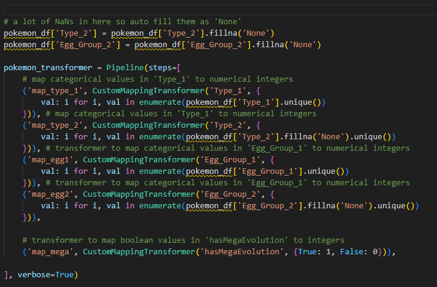

# Pokemon Data Wrangling Pipeline

## Pipeline Overview

My pipeline runs a bunch of custom transformers in order. Most of what it does is convert non-numeric columns to numeric ones, and it also takes care of any missing data.

Here’s a quick visual of the pipeline:

## Pipeline Steps

The pipeline is called `pokemon_transformer` and has these steps:

1. **`map_egg1` (CustomMappingTransformer):**
   Converts the primary egg group (`Egg_Group_1`) into integers by mapping each unique value to its own integer.

2. **`map_type_1` (CustomMappingTransformer):**
   Maps the main Pokémon type (`Type_1`) to integer values.

3. **`map_type_2` (CustomMappingTransformer):**
   Maps the secondary Pokémon type (`Type_2`) to integer values, including `'None'` for missing data.

4. **`impute` (CustomKNNTransformer):**
   Fills in any missing values using KNN imputation, after all categorical columns have been mapped to numbers.

5. **Other features (`Total`, `Sp_Atk`, `Sp_Def`, `Attack`, `Speed`, `Defense`, `HP`) are already numeric and do not require transformation.**

The pipeline **only uses the top 10 features from feature ranking**:
- `Egg_Group_1`, `Total`, `Sp_Atk`, `Sp_Def`, `Attack`, `Speed`, `Type_1`, `Defense`, `HP`, `Type_2`

## Random State
121

